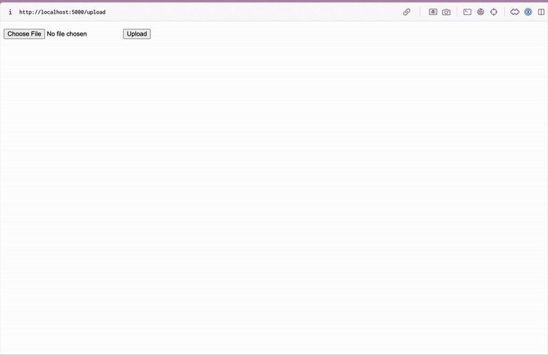

# Flask-on-Docker

This project uses Docker to containerize the application with multiple services working together to serve static files and media uploads. This was built using Flask, Docker, Nginx, PostgreSQL, and Gunicorn. 

## Tech Stack

### Flask
We use Flask as the backend web framework to handle HTTP requests, process logic, and serve responses. It serves as a lightweight way of building web applications.

### Docker
We use Docker to deploy our application, database, and Nginx inside isolated containers. This allows us to maintain consistency across various environments.

### Nginx
We use Nginx as a reverse proxy, as it forwards requests from clients to Flask. It allows for secure request forwarding and handles web traffic more efficiently than Flask's built-in server. 

### PostgreSQL
We use PostgreSQL as our database to store our user uploads. This is a scalable relational database we can use to store structured data.

### Gunicorn
We use Gunicorn as a way to run the Flask application efficiently in a production environment, as it handles concurrent requests better than Flask's built-in server.

## Demo
Below is an example of how one could upload a media file to the database. 

## Getting Started
1. Clone this repository
2. Ensure that the proper environment variables are set, such as in `.env.prod.db` in the root with database credentials.
3. Run `docker compose up -d --build`. This builds the Docker containers and starts our services. Note that Flask is running on port 1044 and Nginx is running on port 1045. 
4. Access the app at `http://localhost:1045/`, which runs the main Flask application.

To see the static files, go to `http://localhost:1045/static/hello.txt`.

To see the upload page for media files, go to `http://localhost:1045/upload`.

To see the media file being served, go to `http://localhost:1045/media/IMAGE_FILE_NAME`.  

